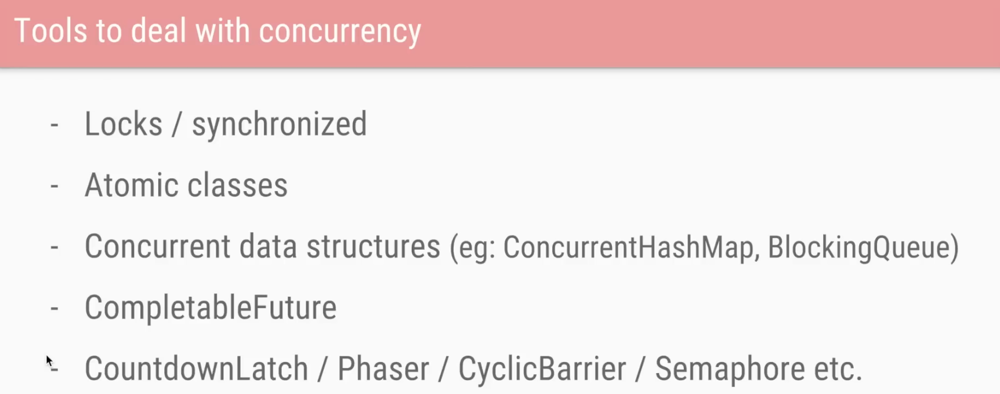

# concurrency and multi-threading

java advanced concurrency resources

* parrallism
  * multiple threads run in paralell independently to reduce computation time
* concurrency
  * concurrency is about dealing with a lot of things at once.

concurrency is applied when:

1. we have a shared resource to be accessed or updated
2. multiple threads need to co-ordinate

### general thread-architechture

<table>
  <tr>
    <th align="center">Thread 1</th>
    <th align="center">Thread 2</th>
  </tr>
  <tr>
    <td align="center">thread-stack</td>
    <td align="center">thread-stack</td>
  </tr>
  <tr>
    <td align="center">Local Cache (L1) </td>
    <td align="center">Local Cache (L2) </td>
  </tr>
  <tr>
    <td colspan="2" align="center">Shared Cache (L3)</td>
  </tr>
  <tr>
    <td colspan="2" align="center">Heap Memory</td>
  </tr>
</table>

### full architechture

